# Voice Assistant Blueprint Pattern — End-to-End Reference

> **Scope:** This document covers the complete voice assistant architecture as implemented in this Home Assistant instance — from the moment someone says a wake word to the moment TTS audio comes out of a speaker. Every layer, every handoff, every damn gotcha.
>
> **Terminology:** All YAML examples use `action:` (current HA syntax, standardized since 2024.x). The older `service:` key still works as an alias but should not be used in new code. If you see `service:` in existing configs, migrate to `action:` when editing.

---

## Table of Contents

1. [Architecture Overview](#architecture-overview)
2. [Layer 1: ESPHome Voice PE Satellites](#layer-1-esphome-voice-pe-satellites)
   - Device Configs
   - Config Structure
   - Key Principles (Dual Wake Word, VAD, Dynamic Model Control)
   - Current Config Issues to Note
3. [Layer 2: HA Voice Pipeline](#layer-2-ha-voice-pipeline)
   - Pipeline-to-Satellite Mapping
4. [Layer 3: Conversation Agents](#layer-3-conversation-agents)
   - Integration Landscape Note (Extended vs Native OpenAI)
   - Agent Naming Convention (§8.4)
   - Mandatory Prompt Sections (§8.3)
   - Separation of Concerns — The Golden Rule (§1.2, §8.2)
   - Tool Exposure (§8.3.2)
   - MCP Servers as Tool Sources (HA 2025.2+)
5. [Layer 4: Blueprints (Orchestration)](#layer-4-blueprints-orchestration)
   - Blueprint Categories in This Setup
   - The Coming Home Pattern (Interactive Conversation)
   - The Proactive LLM Sensors Pattern (One-Shot Announcements)
   - The Voice Active Media Controls Pattern (Command Hub)
6. [Layer 5: Tool Scripts (Thin Wrappers)](#layer-5-tool-scripts-thin-wrappers)
   - Script Blueprint Pattern
   - Current Tool Scripts
   - Why This Architecture?
7. [Layer 6: Helpers (Shared State)](#layer-6-helpers-shared-state)
   - Ducking Flags
   - Volume Storage
   - Voice Command Bridges
8. [TTS Output Patterns](#tts-output-patterns)
   - Three Ways to Speak
   - `ask_question` — Full Capabilities (HA 2025.7+)
   - ElevenLabs Voice Profile Routing
   - Post-TTS Delay (AP-32)
   - TTS Streaming (HA 2025.10+)
9. [Data Flow Summary](#data-flow-summary)
   - Interactive Conversation (Coming Home)
   - One-Shot Announcement (Proactive LLM Sensors)
10. [Common Gotchas & Anti-Patterns](#common-gotchas--anti-patterns)
11. [File Locations Reference](#file-locations-reference)
12. [Style Guide Cross-References](#style-guide-cross-references)

---

## 14. VOICE ASSISTANT PATTERN

### 14.1 Architecture overview

The voice assistant pattern is a multi-layer stack. Each layer has a single responsibility, and they connect through well-defined interfaces. Here's the full chain:

```
┌─────────────────────────────────────────────────────────────────────┐
│                        VOICE INTERACTION CHAIN                      │
├─────────────────────────────────────────────────────────────────────┤
│                                                                     │
│  1. ESPHome Voice PE Satellite                                      │
│     └─ Wake word detection (micro_wake_word)                        │
│     └─ Audio capture → HA voice pipeline                            │
│                                                                     │
│  2. HA Voice Pipeline                                               │
│     └─ STT (speech-to-text)                                         │
│     └─ Conversation agent (intent processing / LLM)                 │
│     └─ TTS (text-to-speech) → back to satellite speaker             │
│                                                                     │
│  3. Conversation Agent (persona)                                    │
│     └─ Static system prompt (personality, permissions, rules)        │
│     └─ Tool scripts (exposed as LLM functions)                      │
│     └─ Dynamic context via extra_system_prompt (from blueprints)     │
│                                                                     │
│  4. Blueprints (orchestration)                                      │
│     └─ Triggers (presence, time, events, GPS)                       │
│     └─ Conversation initiation (start_conversation, ask_question)   │
│     └─ TTS announcements (tts.speak, assist_satellite.announce)     │
│     └─ Device control via service calls                             │
│                                                                     │
│  5. Tool Scripts (thin wrappers)                                    │
│     └─ Single-purpose scripts exposed to LLM agents                 │
│     └─ Trigger centralized automations with command variables        │
│                                                                     │
│  6. Helpers (shared state)                                          │
│     └─ Ducking flags (input_boolean)                                │
│     └─ Volume storage (input_number)                                │
│     └─ Voice command bridges (input_boolean for Alexa)              │
│                                                                     │
└─────────────────────────────────────────────────────────────────────┘
```

**Layer boundary rules (MUST NOT violations):**

Each layer has a single responsibility. Crossing these boundaries creates maintenance nightmares, testing blind spots, and debugging hell. These are not suggestions — they're hard constraints:

| Layer | Responsibility | MUST NOT contain |
|---|---|---|
| **1. ESPHome Satellite** | Audio I/O, wake word detection, hardware config | Conversation logic, device control actions, TTS text generation, persona selection logic |
| **2. Voice Pipeline** | STT → Agent → TTS routing | Business logic, device targeting, conditional flows, automation triggers |
| **3. Conversation Agent** | Personality, permissions, tool calling | Trigger logic, timing/scheduling, sensor state monitoring, direct service calls to HA (use exposed tools instead) |
| **4. Blueprints** | Orchestration, triggers, conditions, flow control | LLM system prompts (use `extra_system_prompt` for dynamic context only), device personality, tool definitions |
| **5. Tool Scripts** | Single-purpose thin wrappers, command relay | Complex logic, multi-step flows, conditional branching (delegate to automations via `automation.trigger`) |
| **6. Helpers** | Shared state coordination (flags, volumes, bridges) | Business logic, automation triggers, service calls |

**Common violations and why they hurt:**
- Putting persona rules in a blueprint instead of the agent prompt → AP-01, forces re-testing personality when you change trigger logic.
- Adding `choose` branching in a tool script instead of the centralized automation → duplicates logic across multiple scripts, breaks "single source of truth."
- Configuring device targeting in the ESPHome config instead of the blueprint → requires reflashing hardware to change which lights respond to voice commands.

> 📋 **QA Check ARCH-1:** Layer boundary enforcement — the 6-layer voice pattern needs explicit MUST NOT rules per layer. See `09_qa_audit_checklist.md`.

---

### 14.2 Layer 1 — ESPHome Voice PE satellites

The physical hardware. Each satellite is an ESPHome-flashed Home Assistant Voice Preview Edition device with a microphone array, speaker, and onboard wake word processing.

### Device Configs

Two satellites exist in this setup, each assigned to a room and persona:

| Satellite | Hostname | Friendly Name | Persona | Wake Words |
|-----------|----------|---------------|---------|------------|
| Workshop  | `home-assistant-voice-0905c5` | HA Workshop | Rick | `hey_rick`, `yo_rick` |
| Living Room | `home-assistant-voice-0a0109` | HA Living Room | Quark | `hey_quark`, `yo_quark` |

### Config Structure

Every satellite config follows the mandatory section order from §6.1:

```yaml
# ── Identity ──────────────────────────────────────────
substitutions:
  name: home-assistant-voice-0905c5
  friendly_name: HA Workshop

# ── Base package ──────────────────────────────────────
packages:
  Nabu Casa.Home Assistant Voice PE:
    github://esphome/home-assistant-voice-pe/home-assistant-voice.yaml

# ── Core config ───────────────────────────────────────
esphome:
  name: ${name}
  name_add_mac_suffix: false
  friendly_name: ${friendly_name}

# ── Connectivity ──────────────────────────────────────
api:
  encryption:
    key: !secret api_key_workshop    # ⚠️ SHOULD be !secret, not inline

wifi:
  ssid: !secret wifi_ssid
  password: !secret wifi_password

# ── Persona wake words ────────────────────────────────
# 🔽 Rick's wake words — Workshop satellite
micro_wake_word:
  models:
    - id: hey_rick
      model: http://homeassistant.local:8123/local/microwake/hey_rick.json
    - id: yo_rick
      model: http://homeassistant.local:8123/local/microwake/yo_rick.json
```

### Key Principles

**Dual wake word support (HA 2025.10+).** Each satellite supports up to **two active wake words**, each mapped to a **separate voice pipeline**. This means a single Voice PE can serve two personas (e.g., "Hey Rick" → Rick's pipeline, "Hey Quark" → Quark's pipeline) on one device. Configure via Settings → Devices → Voice PE → Configure, or programmatically via the `assist_satellite/set_wake_words` WebSocket API. Trade-off: more wake words = slightly higher CPU load and marginally increased false-positive risk. For this setup, we currently run one persona per satellite for clarity, but this is a **preference**, not a technical limitation.

**Extend, don't replace.** The `micro_wake_word.models` list is *appended* to the base package's default models (like `okay_nabu`). You only specify what you're adding — see §6.3.

**Wake word model hosting.** Custom `.json` and `.tflite` files live in `/config/www/microwake/` and are served via `http://homeassistant.local:8123/local/microwake/`. Each model needs both files:
- `hey_rick.json` — model metadata (must be v2 schema with `micro` object)
- `hey_rick.tflite` — the actual TFLite inference model

**VAD (Voice Activity Detection) — recommended since ESPHome 2025.5+.** Adding a `vad:` model to `micro_wake_word` significantly reduces false positives from non-speech sounds. The official VAD model is available from the ESPHome micro-wake-word-models repo:

```yaml
micro_wake_word:
  vad:
  models:
    - id: hey_rick
      model: http://homeassistant.local:8123/local/microwake/hey_rick.json
    - id: yo_rick
      model: http://homeassistant.local:8123/local/microwake/yo_rick.json
```

**Dynamic model control (ESPHome 2025.5+).** Wake word models can be enabled/disabled at runtime via `micro_wake_word.enable_model` and `micro_wake_word.disable_model` actions, and HA can change the active on-device wake word via the satellite configuration API. The `on_wake_word_detected` automation hook provides the detected wake word phrase as a variable for routing.

**Microphone gain factor.** Since ESPHome 2025.5, the microphone subsystem was refactored. If your microphone was previously configured for 32 bits per sample, add `gain_factor: 4` to `voice_assistant:` to match previous behavior.

### Current Config Issues to Note

Both satellite configs have **inline API encryption keys** instead of `!secret` references. Per §6.4 and AP-25, these should be migrated to `/config/esphome/secrets.yaml` as `!secret api_key_workshop` and `!secret api_key_living_room`.

> 📋 **QA Check SEC-1:** No inline secrets — API keys, tokens, and passwords must use `!secret` references. See `09_qa_audit_checklist.md`.

---

### 14.3 Layer 2 — HA Voice Pipeline

The Voice Pipeline is configured in the HA UI (Settings → Voice Assistants). Each pipeline connects:

1. **STT engine** — converts microphone audio to text
2. **Conversation agent** — processes the text (intent matching or LLM)
3. **TTS engine** — converts the response back to speech

Each satellite is assigned a pipeline. The pipeline determines which conversation agent handles the interaction — this is how "Hey Rick" in the Workshop routes to Rick's agent, and "Hey Quark" in the Living Room routes to Quark's.

### Pipeline-to-Satellite Mapping

The pipeline assignment happens in the satellite's device config within HA (Settings → Devices → select the Voice PE → Configure). The key setting is which voice pipeline the satellite uses by default.

Blueprints can override this by targeting specific conversation agents directly via `conversation.process` or `assist_satellite.start_conversation` with an explicit `extra_system_prompt`.

---

### 14.4 Layer 3 — Conversation agents

This is where personality lives. The conversation agent is configured through whichever integration you're using and holds the **static system prompt**.

> **⚠️ Integration landscape note (2025+):** This setup currently uses **Extended OpenAI Conversation** (HACS custom integration by jekalmin), which pioneered function/tool calling for HA. Since HA 2024.6+, the **native OpenAI Conversation integration** gained Assist API tool calling, and since HA 2025.7, it supports **sub-entries** (multiple agents with different prompts from one API key). The native integration now covers most Extended features. If Extended falls behind on maintenance, migration to native is straightforward — the architectural patterns in this guide (prompt structure, tool exposure, separation of concerns) apply identically to both. The key difference: Extended uses custom YAML function specs, while native uses the built-in Assist API with exposed entities/scripts. See §8.1 for integration-specific documentation requirements.

### Agent Naming Convention (§8.4)

Pattern: `<Persona> - <Integration>[ - <Variant>]`

Examples from this setup:
- `Rick - Extended` — general purpose Rick, Extended OpenAI Conversation
- `Quark - Extended` — general purpose Quark, same integration
- `Rick - Extended - Verbose` — detailed responses variant

> **Note:** Scenario-specific context (arrival, bedtime, proactive) is injected via `extra_system_prompt`, not by creating separate agents — see §8.4.

### Mandatory Prompt Sections (§8.3)

Every agent prompt MUST contain these four sections in order:

**1. PERSONALITY** — Who the agent is, tone, mannerisms, response length constraints.

**2. PERMISSIONS** — Explicit allowlist of devices with entity IDs and allowed services. Table format:

```
| Device             | Entity ID                | Allowed services                         |
|--------------------|--------------------------|------------------------------------------|
| Workshop lights    | light.workshop_lights    | light.turn_on / light.turn_off / toggle  |
| Workshop speaker   | media_player.workshop    | media_player.volume_set / media_pause    |
```

Followed by: *"You are NOT allowed to control any devices outside this list."*

**3. RULES** — Behavioral rules for the scenario, decision trees, what to do on unclear input, what NOT to do.

**4. STYLE** — Output constraints (max sentences, no emojis, no entity names spoken aloud, "act first, talk second").

### Separation of Concerns — The Golden Rule (§1.2, §8.2)

This is arguably the most important architectural decision in the entire stack:

- **The agent's static system prompt** handles everything that doesn't change per invocation: personality, device permissions, behavioral rules, output style.
- **The blueprint** passes only **dynamic, per-run context** via `extra_system_prompt`: who triggered the automation, what time it is, what sensor readings are relevant right now.

AP-01 exists for a reason: **never bake large LLM system prompts into blueprints.** The blueprint's `extra_system_prompt` should be short — just the facts that change.

```yaml
# GOOD — blueprint passes only dynamic context
extra_system_prompt: >-
  {{ person_name }} just arrived home and heard: "{{ welcome_line }}".
  This is an arrival conversation.

# BAD — blueprint contains the entire personality/rules/permissions prompt
extra_system_prompt: >-
  You are Rick, a sarcastic AI assistant. You may control the following
  devices: light.workshop_lights, light.living_room... [500 more lines]
```

### Tool Exposure (§8.3.2)

When using integrations that support function/tool calling, agents interact with the home through **exposed scripts** — not raw services. This is a critical security boundary:

- The PERMISSIONS section in the prompt is a **second line of defense**, not the first.
- The **first line of defense** is which scripts you expose as tools.
- Never expose raw `homeassistant.turn_off` or system-modifying services.

Each exposed script gets a `description` field written **for the LLM**, not for humans:

```yaml
description: >-
  Pauses whatever is currently playing on the nearest speaker.
  Call this when the user says "pause", "stop the music", "shut up".
  Do NOT call this for volume changes — use voice_volume_set instead.
```

### MCP Servers as Tool Sources (HA 2025.2+)

Since HA 2025.2, **Model Context Protocol (MCP)** servers can extend LLM agent capabilities beyond exposed scripts (with improved native support in 2025.9). MCP servers provide additional tools that the conversation agent can call — e.g., fetching news, querying to-do lists, accessing external APIs, or even talking to other AI services.

For this setup, the exposed-scripts-as-tools pattern remains the **primary tool interface** for device control. MCP is complementary — use it for capabilities that don't map cleanly to HA service calls (information retrieval, external data, multi-step reasoning). The same security principle applies: only connect MCP servers you trust, as they extend what the LLM can do.

Conversely, HA can also act as an **MCP server**, exposing your home's entities and actions to external AI systems. This is configured separately from the conversation agent stack.

> **Decision guide:** Use exposed scripts for device control (lights, media, climate). Use MCP for information retrieval and external integrations. Don't use MCP as a replacement for the thin-wrapper script pattern — scripts give you validation, logging, and a single source of truth.

---

### 14.5 Layer 4 — Blueprints (orchestration)

Blueprints are the orchestration layer — they handle triggers, conditions, timing, flow control, and conversation initiation. They do NOT contain personality or device rules.

### Blueprint Categories in This Setup

| Blueprint | Pattern | Trigger | Conversation Style |
|-----------|---------|---------|-------------------|
| **Coming Home** | Arrival welcome | Person entity `not_home` → `home` | `assist_satellite.start_conversation` — interactive, multi-turn |
| **Proactive LLM Sensors** | Presence-based suggestions | Presence sensor ON + time_pattern (nag) | `tts.speak` — one-shot announcement, optional `ask_question` |
| **LLM Alarm** | Wake-up alarm | Time trigger + weekday filter | `tts.speak` — one-shot, then mobile notification wait |
| **Voice Active Media Controls** | Media control hub | Programmatic (`automation.trigger` from scripts) | No conversation — pure device control |

### The Coming Home Pattern (Interactive Conversation)

This is the most complex blueprint and the canonical example of how all layers interact. Flow:

```
GPS arrives → wait for entrance sensor → reset speakers →
turn on temp switches → wait for entrance clear →
generate AI greeting via conversation.process →
start interactive conversation on satellite via
  assist_satellite.start_conversation →
delay → cleanup temp switches
```

Key architectural decisions:

**1. Two-stage arrival confirmation.** GPS trigger alone isn't reliable (bounces, tunnels). The blueprint waits for a physical entrance occupancy sensor before proceeding. GPS bounce protection is handled by a cooldown condition using `this.attributes.last_triggered`.

**2. Speaker reset before conversation.** Toggling power switches clears stale Bluetooth connections on the Voice PE. This is a hardware workaround, but it's in the blueprint because it's timing-sensitive (must happen after entrance confirmation, before conversation starts).

**3. Greeting generation is separate from the conversation.** The blueprint calls `conversation.process` to generate a one-shot greeting line, then passes that line to `assist_satellite.start_conversation` as the `start_message`. The interactive conversation that follows uses the agent's own system prompt — the blueprint just provides arrival context via `extra_system_prompt`.

```yaml
# Generate the greeting (one-shot, no conversation)
- action: conversation.process
  data:
    agent_id: !input conversation_agent
    text: !input ai_greeting_prompt
  response_variable: ai_greeting

# Start the interactive conversation on the satellite
- action: assist_satellite.start_conversation
  target: !input assist_satellites
  data:
    preannounce: true
    start_message: "{{ welcome_line }}"
    extra_system_prompt: >-
      {{ person_name }} just arrived home and heard: "{{ welcome_line }}".
      This is an arrival conversation.
```

**4. Guaranteed cleanup.** Every exit path (timeout, entrance never cleared, normal completion) turns off the temporary switches. This is mandatory per §5.1 and AP-06.

### The Proactive LLM Sensors Pattern (One-Shot Announcements)

A simpler but more featureful blueprint. It generates context-aware messages when presence is detected in a room during configured time windows.

Key features:
- **Nag mode** — can repeat messages at configurable intervals while presence persists, with max nag limits per session
- **Weekday/weekend profiles** — separate time windows, cooldowns, and LLM prompts for weekdays vs weekends
- **Sensor context injection** — feeds arbitrary entity states into the LLM prompt as live context
- **Bedtime question** — optional follow-up using `assist_satellite.ask_question` with yes/no parsing, can trigger a bedtime script
- **ElevenLabs voice profile routing** — conditional `options.voice_profile` inclusion using `choose` blocks (not templated dicts)

The LLM prompt assembly pattern:

```yaml
- action: conversation.process
  data:
    agent_id: !input conversation_agent
    text: >
      {{ llm_prompt }}

      context:
      - area: {{ area_name }}
      - time_of_day: {{ tod_label }}
      - trigger_type: {{ trigger.platform }}
      - current_time: {{ now().strftime('%Y-%m-%d %H:%M') }}
      - extra_entities:
      {{ sensor_context }}

      task:
      respond with ONE short, natural sentence you would say out loud
      maximum 220 characters. do not include quotation marks.
```

**Response extraction with robust fallback** — always handle the case where the LLM returns garbage or nothing:

```yaml
proactive_message: >
  
  
    
    
      {{ fallback | trim }}
    
      {{ txt }}
    
  
    {{ fallback | trim }}
  
```

Every single one of those `is defined` checks matters. The response object structure varies between conversation integrations, and any of those keys could be missing.

**Response structure by integration:**

| Integration | Response path | Notes |
|-------------|--------------|-------|
| Native OpenAI / Anthropic / Google | `response.speech.plain.speech` | Standard Assist API response format |
| Extended OpenAI Conversation | `response.speech.plain.speech` | Same structure, but tool call errors may return differently |
| Ollama (local) | `response.speech.plain.speech` | Same structure; may return empty on timeout |
| Built-in HA intent engine | `response.speech.plain.speech` | Same path, but `speech` is typically a short confirmation |

The deep `is defined` chain shown above is tested against Extended OpenAI Conversation but works defensively across all integrations. If you switch integrations and the extraction breaks, check the trace in Developer Tools → Automations → Traces to inspect the actual `response_variable` structure.

### The Voice Active Media Controls Pattern (Command Hub)

This is a pure automation — no voice pipeline, no conversation. It exists as the centralized brain for media control, invoked programmatically by thin wrapper scripts.

Architecture:

```
LLM Agent sees user say "pause the music"
  → calls script.voice_media_pause (exposed tool)
    → script calls automation.trigger with command: "pause_active"
      → automation finds highest-priority playing media_player
        → pauses it
```

Three commands: `pause_active`, `stop_radio`, `shut_up`.

The automation uses `expand()` with `selectattr` for priority-based player resolution:

```yaml
active_target: >-
  
  {{ active[0].entity_id if active | count > 0 else 'none' }}
```

Mode is `parallel` with `max_exceeded: silent` — multiple commands can arrive in quick succession.

> 📋 **QA Check CQ-10:** Multi-step flows (LLM → TTS → speaker, presence → music → volume duck) should include observability hooks on failure paths. See `09_qa_audit_checklist.md`.

---

### 14.6 Layer 5 — Tool scripts (thin wrappers)

These are the bridge between the LLM agent and the automation layer. Each script does exactly one thing: pass a command to the Voice Active Media Controls automation.

### Script Blueprint Pattern

Each script blueprint:
1. Accepts a single input: which automation to trigger
2. Validates the automation exists and is enabled
3. Calls `automation.trigger` with `skip_condition: true` and a `command` variable
4. Includes configurable phrase lists for documentation (copied into agent prompts)

```yaml
sequence:
  # Validate the automation is available
  - if:
      - condition: template
        value_template: "{{ missing_or_disabled }}"
    then:
      - action: persistent_notification.create
        data:
          title: "Voice – Pause Active Media – Misconfiguration"
          message: >- ...
      - stop: "Active media automation not available"

  # Fire the command
  - action: automation.trigger
    target:
      entity_id: "{{ active_media_automation }}"
    data:
      skip_condition: true
      variables:
        command: "pause_active"
```

### Current Tool Scripts

| Script Blueprint | Command | LLM Trigger Phrases |
|-----------------|---------|-------------------|
| `voice_media_pause` | `pause_active` | "pause", "pause it", "stop the music", "pause the TV" |
| `voice_stop_radio` | `stop_radio` | "stop radio", "turn off the radio" |
| `voice_shut_up` | `shut_up` | "shut up", "be quiet", "stop everything" |

### Why This Architecture?

**Single source of truth.** All media control logic lives in one automation. Adding a new media player means updating one config, not three scripts.

**Clean LLM tools.** The agent sees simple, single-purpose scripts with clear descriptions. It doesn't need to understand priority resolution or player state checking.

**Testability.** You can trigger the automation manually with any command from Developer Tools → Services without going through the LLM.

---

### 14.7 Layer 6 — Helpers (shared state)

Helpers are the glue between automations that need to coordinate. Three patterns dominate the voice assistant stack:

### Ducking Flags (`input_boolean`)

When TTS speaks over active music, the volume needs to be ducked (lowered), then restored. A shared `input_boolean` (e.g., `input_boolean.voice_pe_ducking`) acts as a coordination flag:

- Set ON before ducking volume
- Other automations (like volume sync) check this flag and pause their behavior
- Set OFF after restoring volume

Without this flag (AP-33), volume sync automations will fight the duck/restore cycle and create feedback loops that sound like a DJ having a stroke.

### Volume Storage (`input_number`)

The Voice PE duck/restore blueprints store each player's pre-duck volume in dedicated `input_number` helpers (range 0.0–1.0). This survives across the async duck/restore cycle and handles the edge case where a player doesn't expose `volume_level` right after an HA restart.

### Voice Command Bridges (`input_boolean` for Alexa)

Alexa can't call MA services directly. The bridge pattern:

```
"Alexa, turn on Radio Klara" → input_boolean.radio_klara ON
  → automation triggers → presence detection → MA play
```

**Critical rule (AP-34):** Auto-reset the boolean FIRST, before any conditions. If a condition aborts the run and the boolean stays ON, the next voice command can't toggle it.

---

### 14.8 TTS output patterns

#### Three ways to speak

| Method | Use When | Ducks Music? | Interactive? |
|--------|----------|-------------|-------------|
| `tts.speak` | One-shot announcements to any media_player | Manual duck/restore needed | No |
| `assist_satellite.announce` | One-shot to Voice PE satellites | Auto-ducks (satellite enters "responding" state) | No |
| `assist_satellite.start_conversation` | Interactive multi-turn dialog | Auto-ducks via pipeline | Yes |
| `assist_satellite.ask_question` | Structured Q&A with sentence matching | Auto-ducks via pipeline | Yes (structured answers + slot extraction) |

> 📋 **QA Check CQ-7:** TTS message templates and conversation response extraction must guard against `unavailable`/`unknown`/`None` — use `| default()` and multi-level `is defined` checks. See `09_qa_audit_checklist.md`.

### `ask_question` — Full Capabilities (HA 2025.7+)

`assist_satellite.ask_question` is far more than a yes/no tool. It supports **sentence template matching with named slot extraction**, works fully locally with Speech-to-Phrase, and returns structured response data.

Key features:
- **Sentence templates with slots** — `"genre {genre}"`, `"set timer for {minutes} minutes"` — slots are extracted and available in `response_variable.slots`
- **Multiple answer groups** — each with an `id` and list of `sentences`, matched against the STT transcript
- **Open-ended mode** — omit `answers` entirely, and `response_variable.sentence` returns the raw transcript text
- **Response fields** — `response_variable.id` (matched answer ID), `response_variable.slots` (extracted slot values), `response_variable.sentence` (raw transcript)
- **Preannounce control** — `preannounce: true/false`, `preannounce_media_id` for custom chimes

```yaml
# Example: structured question with slot extraction
- action: assist_satellite.ask_question
  data:
    entity_id: !input assist_satellite
    question: "What kind of music do you want to listen to?"
    answers:
      - id: genre
        sentences:
          - "genre {genre}"
          - "{genre} music"
      - id: artist
        sentences:
          - "artist {artist}"
          - "something by {artist}"
  response_variable: answer

# Use the extracted slots
- choose:
    - conditions: "{{ answer.id == 'genre' }}"
      sequence:
        - action: music_assistant.play_media
          data:
            media_id: "My {{ answer.slots.genre }} playlist"
            media_type: playlist
          target:
            entity_id: !input media_player
```

**No-answer handling (known gotcha):** If the user doesn't respond, `ask_question` throws an error. Wrap it in `continue_on_error: true` and check `{{ answer is defined }}` in subsequent conditions. This is a known community pain point — see AP-04 (timeout handling).

### ElevenLabs Voice Profile Routing

> **⚠️ Integration-specific:** The `voice_profile` option used below is specific to the **`HA-ElevenLabs-Custom-TTS` HACS integration** ([loryanstrant/HA-ElevenLabs-Custom-TTS](https://github.com/loryanstrant/HA-ElevenLabs-Custom-TTS)), NOT the native HA ElevenLabs integration. The native integration uses `voice` (voice ID) and `model` as its `options` parameters. If you're on the native integration, replace `voice_profile` with `voice` in the pattern below. The conditional `choose` block pattern itself is valid for either integration — you should always guard optional TTS options to avoid sending empty values to engines that don't expect them.

When using ElevenLabs custom TTS, the `voice_profile` option must be conditionally included — sending an empty profile to non-ElevenLabs engines will choke:

```yaml
- choose:
    - conditions:
        - condition: template
          value_template: "{{ voice_profile | default('') | string | length > 0 }}"
      sequence:
        - action: tts.speak
          target:
            entity_id: !input tts_engine
          data:
            media_player_entity_id: "{{ player }}"
            message: "{{ message }}"
            options:
              voice_profile: !input voice_profile
  default:
    - action: tts.speak
      target:
        entity_id: !input tts_engine
      data:
        media_player_entity_id: "{{ player }}"
        message: "{{ message }}"
```

### ElevenLabs Fallback Pattern

ElevenLabs is a cloud API — it can fail due to rate limits, API outages, network issues, or expired API keys. For critical voice flows (alarms, security announcements), always have a fallback TTS engine:

```yaml
- alias: "Speak with ElevenLabs, fallback to HA Cloud/Piper"
  action: tts.speak
  target:
    entity_id: !input tts_engine           # Primary: ElevenLabs
  data:
    media_player_entity_id: "{{ player }}"
    message: "{{ tts_message }}"
    options:
      voice_profile: !input voice_profile
  continue_on_error: true

- alias: "Brief pause to confirm TTS delivery"
  delay:
    seconds: 2

- alias: "Fallback TTS if primary didn't play"
  if:
    - condition: template
      value_template: >-
        {{ states(player) not in ['playing', 'buffering'] }}
  then:
    - action: tts.speak
      target:
        entity_id: !input fallback_tts_engine   # Fallback: tts.home_assistant_cloud or tts.piper
      data:
        media_player_entity_id: "{{ player }}"
        message: "{{ tts_message }}"
      continue_on_error: true
```

**Blueprint input for fallback TTS:**

```yaml
fallback_tts_engine:
  name: Fallback TTS engine
  description: >-
    Used when the primary TTS engine fails (rate limits, API outage).
    Recommended: Home Assistant Cloud TTS or Piper (local).
  default: tts.home_assistant_cloud
  selector:
    entity:
      filter:
        - domain: tts
```

**When to use the fallback pattern:**
- Alarm/wake-up flows — silence is not an acceptable failure mode.
- Security announcements — "someone is at the door" must get through.
- Any flow where TTS failure breaks the user experience.

**When to skip it:**
- Casual proactive messages — if ElevenLabs is down, a missed "good morning" is fine.
- Interactive conversations via `start_conversation` — the pipeline handles TTS errors internally.

> **Note:** The fallback engine won't have the ElevenLabs voice — the user will hear the default HA Cloud or Piper voice. This is acceptable for reliability; personality is secondary to the message getting through.

### Post-TTS Delay (AP-32)

ElevenLabs and other streaming TTS engines return from `tts.speak` *before* the audio finishes playing. **Always** include a configurable delay before restoring volume or starting the next action. Default: 5 seconds. Expose it as a blueprint input.

### TTS Streaming (HA 2025.10+)

Since HA 2025.10, **streaming TTS** is supported for Piper (local) and Home Assistant Cloud TTS. Instead of generating the entire audio response before playback begins, streaming TTS starts speaking as soon as the LLM produces the first few words — reducing perceived latency by up to **10x** (from 5+ seconds to ~0.5 seconds for LLM responses).

**Configuration:** TTS streaming is enabled automatically when all three conditions are met:
1. The TTS engine supports streaming (Piper, HA Cloud TTS — as of writing).
2. The voice pipeline is configured to use a streaming-compatible TTS engine.
3. The satellite/media player supports chunked audio playback (Voice PE does; some third-party players may not).

There is no manual toggle — if your pipeline meets these conditions, streaming just works. If it doesn't work, check that your Piper add-on and HA Core are both on 2025.10+ and that the pipeline's TTS engine is set to a streaming-compatible engine.

**Implications for this setup:**
- **Piper / HA Cloud TTS:** Streaming is automatic. The post-TTS delay (§7.4, AP-32) may need to be shorter since playback starts earlier, but the delay is still needed — streaming doesn't change the fact that `tts.speak` returns before audio completes.
- **ElevenLabs:** As of this writing, **neither** the native HA ElevenLabs integration nor the custom HACS integration (`HA-ElevenLabs-Custom-TTS`) supports HA's streaming TTS protocol. The post-TTS delay anti-pattern (AP-32) **still applies in full** for ElevenLabs. When ElevenLabs adds streaming support, re-test your post-TTS delay values.
- **LLM verbosity:** Streaming exposed that LLMs can be very verbose — users hear every rambling word in real-time instead of just waiting. Keep your agent prompts' STYLE section tight with max-sentence limits (e.g., "Max 2 sentences per response") to avoid 30-second monologues.

> **📌 Documentation status:** The HA streaming TTS API is still evolving. The TTS streaming architecture docs were sparse at launch. If you're building custom TTS integrations or third-party media players that need to support streaming, check the [HA TTS developer docs](https://developers.home-assistant.io/docs/voice/tts/) for the latest protocol details.

---

### 14.9 Data flow summary

Here's the complete data flow for the two primary patterns:

### Interactive Conversation (Coming Home)

```mermaid
flowchart TD
    A["Person: not_home → home"] --> B{"Cooldown check"}
    B -->|Pass| C["Wait: entrance sensor ON"]
    B -->|Fail| Z["Abort"]
    C --> D["Reset speaker switches"]
    D --> E["Turn on temp switches"]
    E --> F["Wait: entrance sensor OFF"]
    F --> G["conversation.process\n(generate greeting)"]
    G --> H["assist_satellite.start_conversation\n(interactive voice loop)"]
    H --> I["Satellite: TTS → Listen → Agent → TTS → ..."]
    I --> J["Post-conversation delay"]
    J --> K["Cleanup: turn off temp switches"]

    style G fill:#4a9eff,color:#fff
    style H fill:#4a9eff,color:#fff
    style I fill:#2ecc71,color:#fff
```



**Detailed step-by-step:**

```
1. Person entity: not_home → home (GPS)
2. Blueprint condition: cooldown check passes
3. Blueprint waits: entrance occupancy sensor → on
4. Blueprint action: reset speaker switches (off → delay → on)
5. Blueprint action: turn on temporary switches
6. Blueprint waits: entrance sensor → off (person moved past door)
7. Blueprint calls: conversation.process (generate greeting line)
   └─ Agent receives: greeting prompt with {{ person_name }}
   └─ Agent returns: snarky one-liner
8. Blueprint calls: assist_satellite.start_conversation
   └─ Satellite receives: start_message (the greeting) + extra_system_prompt (arrival context)
   └─ Satellite speaks: the greeting via TTS
   └─ Satellite listens: for user's voice response
   └─ Pipeline processes: STT → Conversation Agent → TTS
   └─ Agent uses: its own static system prompt + extra_system_prompt + exposed tool scripts
   └─ Conversation continues: until user stops talking or satellite times out
9. Blueprint waits: post_conversation_delay
10. Blueprint action: turn off temporary switches (cleanup)
```

### One-Shot Announcement (Proactive LLM Sensors)


**Detailed step-by-step:**

```
1. Presence sensor: off → on (or time_pattern tick while present)
2. Blueprint conditions: day-of-week, time window, cooldown, media not playing, min presence
3. Blueprint builds: sensor_context from context_entities
4. Blueprint calls: conversation.process (generate proactive message)
   └─ Agent receives: llm_prompt + area + time + sensor context + task constraints
   └─ Agent returns: one short sentence
5. Blueprint extracts: response with multi-level fallback
6. Blueprint calls: tts.speak (with conditional ElevenLabs voice_profile)
   └─ TTS engine speaks: through the area's media_player
7. (Optional) Blueprint waits: bedtime_question_delay
8. (Optional) Blueprint calls: conversation.process (generate bedtime question)
9. (Optional) Blueprint calls: assist_satellite.ask_question
   └─ Satellite asks: the LLM-generated question
   └─ Satellite listens: for yes/no response
   └─ If "yes": blueprint calls bedtime_help_script
```

---

### 14.10 Common gotchas & anti-patterns

These are the ones that'll bite you in the ass if you're not careful:

1. **Inline API keys in ESPHome configs** (AP-25) — Both current satellite configs have this. Migrate to `!secret`.

2. **`tts.speak` returns before audio finishes** (AP-32) — Always add a post-TTS delay before restoring volume or starting the next step.

3. **Ducking flag coordination** (AP-33) — Every TTS-over-music flow needs the shared `input_boolean` flag. Volume sync automations MUST check it.

4. **Input boolean bridges: reset FIRST** (AP-34) — Before any condition that could abort the run.

5. **`wait_for_trigger` vs `wait_template`** (AP-04, §5.1) — `wait_for_trigger` waits for a *transition*. If the state is already true, it hangs forever. Use the check-first pattern.

6. **LLM response extraction** — Never trust the response structure. Check `is defined` at every level. Always have a fallback.

7. **`continue_on_timeout: true` on every wait** (AP-04) — With explicit timeout handlers that clean up state.

8. **One agent per persona, deliberate wake word mapping** — Each persona (Rick, Quark) gets one agent with one pipeline. Map wake words to the correct pipeline so "Hey Rick" routes to Rick's agent and "Hey Quark" routes to Quark's. Scenario-specific context (arrival, bedtime, proactive) is injected via `extra_system_prompt` — never create separate agents per scenario (§8.4). If running dual personas on one satellite (supported since HA 2025.10), map each wake word to a dedicated pipeline. **Clarification:** "one agent per persona" limits agent *count*, not tool *sources*. A single `Rick - Extended` agent can use exposed scripts AND MCP-provided tools simultaneously (§8.3.3). The rule prevents scenario-based agent explosion (O(personas×scenarios)), not multi-tool diversity.

---

### 14.11 File locations reference

```
/config/
├── esphome/
│   ├── home-assistant-voice-0905c5.yaml   # Workshop satellite (Rick)
│   ├── home-assistant-voice-0a0109.yaml   # Living Room satellite (Quark)
│   ├── secrets.yaml                       # ESPHome-specific secrets (API keys, WiFi)
│   └── archive/                           # Retired configs (§6.9)
├── www/
│   └── microwake/                         # Custom wake word models
│       ├── hey_rick.json + .tflite
│       ├── yo_rick.json + .tflite
│       ├── hey_quark.json + .tflite
│       └── yo_quark.json + .tflite
├── blueprints/
│   ├── automation/
│   │   ├── madalone/                      # Orchestration blueprints (Coming Home, Proactive, etc.)
│   │   └── voice_pe/                      # Voice PE duck/restore blueprints
│   └── script/
│       └── madalone/                      # Tool script blueprints (pause, stop_radio, shut_up)
└── configuration.yaml                     # HA core config (logger, etc.)

# UI-configured (no file on disk):
# • Conversation agent prompts → Settings → Integrations → [Integration] → Configure
# • Voice pipeline config      → Settings → Voice Assistants
# • Satellite pipeline mapping  → Settings → Devices → [Voice PE] → Configure
```

**Quick reference table:**

| Component | Path |
|-----------|------|
| ESPHome satellite configs | `/config/esphome/home-assistant-voice-*.yaml` |
| ESPHome secrets | `/config/esphome/secrets.yaml` |
| Custom wake word models | `/config/www/microwake/*.json` + `*.tflite` |
| Automation blueprints | `/config/blueprints/automation/madalone/` |
| Script blueprints | `/config/blueprints/script/madalone/` |
| Voice PE duck/restore blueprints | `/config/blueprints/automation/voice_pe/` |
| Conversation agent prompts | Configured in HA UI (integration settings) |
| Voice pipeline config | HA UI → Settings → Voice Assistants |

---

### 14.12 Style guide cross-references

| Topic | Section |
|-------|---------|
| Blueprint YAML structure | §3 (Blueprint Patterns) |
| Input sections (mandatory) | §3.2 |
| Template safety | §3.6 |
| Timeout handling | §5.1 (Automation Patterns) |
| GPS bounce protection | §5.5 |
| Conversation agent prompts | §8 (Conversation Agents) |
| Agent naming | §8.4 |
| ESPHome config structure | §6.1 (ESPHome Patterns) |
| Wake word models | §6.5 |
| TTS duck/restore | §7.4 (Music Assistant Patterns) |
| Voice command bridges | §7.7 |
| Unified media control | §7.8 |
| All anti-patterns | §10 |

> 📋 **QA Check INT-4:** Voice assistant pattern completeness — verify 6-layer MUST NOT boundaries, TTS streaming config, ElevenLabs fallback, one-agent-per-persona clarification, data flow diagrams, directory tree, and `!secret` for API keys are all documented. See `09_qa_audit_checklist.md`.
